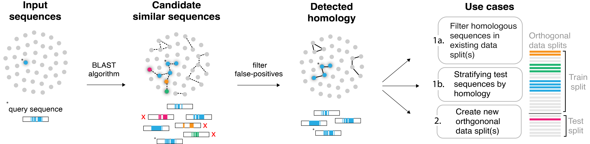

# Overview

Neural networks have emerged as powerful tools to understand the functional relationship between genomic sequences and various biological processes. However, current practices of training and evaluating models on genomic sequences may fail to account for the widespread homology that permeates the genome. Homology spanning train-test data splits can result in [data leakage](https://en.wikipedia.org/wiki/Leakage_(machine_learning)#:~:text=In%20statistics%20and%20machine%20learning,when%20run%20in%20a%20production), potentially leading to overestimation of model performance and a reduction in model reliability and generalizability.



hashFrag is a scalable command-line tool to help users address homology-based data leakage during model development. The general workflow involves identifying “candidate” pairs of sequences exhibiting high similarity with [BLAST](https://blast.ncbi.nlm.nih.gov/Blast.cgi), filtering these candidates based on a specified similarity threshold, and then using the resulting homology information to mitigate the potential occurrences of data leakage in existing or newly-created splits. 

Local alignment scores are used to quantify the degree of homology between a pair of sequences. By default, the alignment score will be derived from the top BLAST alignment result for a pair of sequences, which we refer to as `lightning` mode (see Basic usage). However, users also have the option to manually compute alignment scores to be used in downstream steps for added control over the homology search process. This version, referred to as `pure` mode, can lead to improved recall when using exact alignment scores (see Advanced usage and `/tutorial` for more details).

# Installation

It is recommended to execute hashFrag in a `conda` or `virtualenv` environment with Python version 3.10.

Clone the repository using the following command:
```
git clone https://github.com/de-Boer-Lab/hashFrag.git
```

Export the source directory to your `PATH`:
```
export PATH="$PATH:./hashFrag/src"
```

(**Optional**) To avoid running the above command every time you open a terminal, add it to your shell configuration file (e.g., `~/.bashrc`) with the following command:
```
echo 'export PATH="$PATH:./hashFrag/src"' >> ~/.bashrc
```

## Installing dependencies

If you are managing your virtual environment with Anaconda or Miniconda, you can directly install dependencies upon creation of the conda environment using the command:
```
conda env create -n hashFrag -f environment.yml
```
* This creates a `conda` environment named "hashFrag"

Alternatively, you can install dependencies located in the `requirements.txt` file with the folowing `pip` command:
```
pip install -r requirements.txt
```

## BLAST+ download

To install the suite of BLAST applications, follow the instructions found at the NCBI BLAST Command Line Applications User Manual [here](https://www.ncbi.nlm.nih.gov/books/NBK279690/).

Directly download the BLAST+ package executables for different operating systems at the following FTP page:
> https://ftp.ncbi.nlm.nih.gov/blast/executables/blast+/LATEST/

Follow the instructions to extract the downloaded file and export binaries to your `PATH`. 

Verify that `blastn` and `makeblastdb` commands were installed succesfully:
```
blastn -version
makeblastdb -version
```

### A minor note on the use of BLAST alignment scores in hashFrag

The `lightning` (default) mode of hashFrag uses pairwise local alignment scores derived from the BLAST algorithm. Rather than directly using the provided alignment scores, however, a *corrected* version of the alignment score is calculated.

Gap scoring is designed to reflect the biological occurrence of insertions and deletions in sequences. Typically, opening a gap incurs a larger penalty (`gapopen`), while subsequent extension of the same gap incurs smaller penalties (`gapextend`). Upon encountering a gap *opening* event, the BLAST algorithm applies the `gapextend` penalty in addition to a `gapopen` penalty. To conform to exact local alignment scoring conventions, we adjust the BLAST scores such that only the `gapopen` penalty is applied to gap opening events.  

# Basic usage

Example usage of hashFrag is provided below on an example dataset composed of 10,000 sequences (each 200 base pairs in length).

Note that the `filter_existing_splits` and `create_orthogonal_splits` pipelines require specification of a pairwise alignment score threshold to define homology between sequences.

> If users do not have a predefined threshold for homology, we recommend computing pairwise alignment scores between a set of random (e.g., dinucleotide shuffled) genomic sequences, and then defining a threshold above the distribution of values observed.

Defining homology in terms of alignment scores requires the specification of scoring parameters (e.g., `penalty`, `gapopen`, `gapextens`, and `reward` values).

The default scoring parameters are as follows:

* `penalty`: -1
* `reward`: 1
* `gapopen`: -2
* `gapextend`: -1

> To remain consistent with BLAST scoring parameter specification, hashFrag expects a negative value for `penalty` but a positive value for `gapopen` and `gapextend` arguments (gap penalties will be subtracted from the alignment score during calculation). A positive value is expected for `reward`.

Changing these parameters can drastically impact the identification process of homology. Please see permissible scoring parameter combinations for the BLASTn algorithm [here](https://www.ncbi.nlm.nih.gov/sites/books/NBK279684/) (Table D1).

hashFrag expects both the forward and reverse orientation of sequences to be included in the input FASTA files. If a dataset has only one orientation, the user must add in the corresponding reverse orientations of sequences. Currently, hashFrag expects reverse strand sequences to be annotated with a `_Reversed` suffix. 

> For example, for sequence ID `seq_A`, there should be a corresponding `seq_A_Reversed` sequence that is its reverse complement.

## Existing data splits

Existing train-test data splits can be handled by providing two separate FASTA files to hashFrag as input. This limits the homology search process to inter-data split comparisons. Specifically, a BLAST database is constructed over the train sequences and the test sequences are queried against this database to identify pairs with high local alignment scores. 

### Filter sequences in the test split exhibiting homology with any sequences in the train split.
```
hashFrag filter_existing_splits \
--train_fasta_path example_train_split.fa.gz \
--test_fasta_path example_test_split.fa.gz \
-t 60 \ # threshold
-o filter_existing_splits.work
```

The table below describes relevant arguments for the `filter_existing_splits` execution:
| Argument | Description | Expected input |
|---|---|---|
| `--train_fasta_path` | Input file containing train split sequences. | FASTA file path (unzipped or gzipped) |
| `--test_fasta_path` | Input file containing test split sequences. | FASTA file path (unzipped or gzipped) |
| `-w`, `--word_size` | Length of exact match to intialize alignment score calculation (`blastn_module`). | integer (Default: 11) |
| `-g`, `--gapopen` | Penalty for opening a gap in the alignment (`blastn_module`) | positive integer (Default: 2) |
| `-x`, `--gapextend` | Penalty for extending an existing gap in the alignment (`blastn_module`). | positive integer (Default: 1) |
| `-p`, `--penalty` | Nucleotide mismatch penalty (`blastn_module`). | negative integer (Default: -1) |
| `-r`, `--reward` | Nucleotide match reward (`blastn_module`). | positive integer (Default: 1) |
| `-m`, `--max_target_seqs` | Maximum number of target sequences that can be returned per query sequence (`blastn_module`). | positive integer (Default: 500) |
| `--xdrop_ungap`| X-drop threshold (heuristic value in bits) for ungapped alignment extension (`blastn_module`). | real number (Default: 20) |
| `--xdrop_gap` | X-drop threshold (heuristic value in bits) for gapped alignment extension (`blastn_module`). | real number (Default: 30) |
| `--xdrop_gap_final` | X-drop threshold (heuristic value in bits) for final alignment extension (`blastn_module`) | real number (Default: 100) |
| `-e`, `--e_value` | Likelihood threshold required to report a sequence as a match (`blastn_module`). | real number (Default: 10.0) |
| `-d`, `--dust` | Filter for low-complexity (i.e., repetitive) regions (`blastn_module`). | Permissible values: {'yes', 'no'} (Default: 'no') |
| `--blastdb_label` | Label for the BLAST database (`blastn_module`). | string (Default: None) |
| `-T`, `--threads` | Number of threads to use for `blastn_module` execution. | positive integer (Default: 1) |
| `-t`, `--threshold` | Alignment score threshold to define a pair of sequences as similar, or homologous (`filter_candidates_module`). | all real numbers (*Required*) |
| `--force` | Force overwrite existing `blastn_module` output files. | Boolean (Default: False) |
| `-o`, `--output_dir` | Directory to write intermediate results. | string (Default: '.') |


### Stratify the test split sequences into an arbitrary number of levels based on their maximum alignment scores to the train split sequences. 
```
hashFrag stratify_test_split \
--train_fasta_path example_train_split.fa.gz \
--test_fasta_path example_test_split.fa.gz \
-o stratify_test_split.work
```

* Note that the sizes of each stratified level will not necessarily be balanced.
* This can be useful to better understand a model’s behaviour over test splits at varying levels of orthogonality to the sequences the model was trained on.


The table below describes relevant arguments for the `stratify_test_split` execution:
| Argument | Description | Expected input |
|---|---|---|
| `--train_fasta_path` | Input file containing train split sequences. | FASTA file path (unzipped or gzipped) |
| `--test_fasta_path` | Input file containing test split sequences. | FASTA file path (unzipped or gzipped) |
| `-w`, `--word_size` | Length of exact match to intialize alignment score calculation (`blastn_module`). | integer (Default: 11) |
| `-g`, `--gapopen` | Penalty for opening a gap in the alignment (`blastn_module`) | positive integer (Default: 2) |
| `-x`, `--gapextend` | Penalty for extending an existing gap in the alignment (`blastn_module`). | positive integer (Default: 1) |
| `-p`, `--penalty` | Nucleotide mismatch penalty (`blastn_module`). | negative integer (Default: -1) |
| `-r`, `--reward` | Nucleotide match reward (`blastn_module`). | positive integer (Default: 1) |
| `-m`, `--max_target_seqs` | Maximum number of target sequences that can be returned per query sequence (`blastn_module`). | positive integer (Default: 500) |
| `--xdrop_ungap`| X-drop threshold (heuristic value in bits) for ungapped alignment extension (`blastn_module`). | real number (Default: 20) |
| `--xdrop_gap` | X-drop threshold (heuristic value in bits) for gapped alignment extension (`blastn_module`). | real number (Default: 30) |
| `--xdrop_gap_final` | X-drop threshold (heuristic value in bits) for final alignment extension (`blastn_module`) | real number (Default: 100) |
| `-e`, `--e_value` | Likelihood threshold required to report a sequence as a match (`blastn_module`). | real number (Default: 10.0) |
| `-d`, `--dust` | Filter for low-complexity (i.e., repetitive) regions (`blastn_module`). | Permissible values: {'yes', 'no'} (Default: 'no') |
| `--blastdb_label` | Label for the BLAST database (`blastn_module`). | string (Default: None) |
| `-T`, `--threads` | Number of threads to use for `blastn_module` execution. | positive integer (Default: 1) |
| `-s`, `--step` | Step size for how large each alignment score range is (`stratify_test_split_module`). | positive integer (Default: 10) |
| `--force` | Force overwrite existing `blastn_module` output files. | Boolean (Default: False) |
| `-o`, `--output_dir` | Directory to write the created train-test splits. | string (Default: '.') |

## Creating data splits

When a single FASTA file is provided as input, hashFrag will characterize homology for all pairwise comparisons. This involves constructing a BLAST database over all sequences in the population and then subsequently querying each sequence to the databae. 

### Create homology-aware (i.g., orthogonal) train-test data splits.
```
hashFrag create_orthogonal_splits \
-f example_full_dataset.fa.gz \
-t 60 \
-o create_orthogonal_splits.work
```
The creation of orthogonal train-test splits involves encoding the homologous relationships between sequences as a sparse adjacency matrix (unweighted in accordance with the alignment score threshold). A graph representation of the adjancency matrix is constructed, and then distinct groups of homologous sequences can be identified by finding disconnected subgraphs. From the homology cluster information, splits with no leakage can be created proportionally. 

The table below describes relevant arguments for the `create_orthogonal_splits` execution:
| Argument | Description | Expected input |
|---|---|---|
| `-f`, `--fasta_path` | Input file containing all sequences in the dataset. | FASTA file path (unzipped or gzipped) |
| `-w`, `--word_size` | Length of exact match to intialize alignment score calculation (`blastn_module`). | integer (Default: 11) |
| `-g`, `--gapopen` | Penalty for opening a gap in the alignment (`blastn_module`) | positive integer (Default: 2) |
| `-x`, `--gapextend` | Penalty for extending an existing gap in the alignment (`blastn_module`). | positive integer (Default: 1) |
| `-p`, `--penalty` | Nucleotide mismatch penalty (`blastn_module`). | negative integer (Default: -1) |
| `-r`, `--reward` | Nucleotide match reward (`blastn_module`). | positive integer (Default: 1) |
| `-m`, `--max_target_seqs` | Maximum number of target sequences that can be returned per query sequence (`blastn_module`). | positive integer (Default: 500) |
| `--xdrop_ungap`| X-drop threshold (heuristic value in bits) for ungapped alignment extension (`blastn_module`). | real number (Default: 20) |
| `--xdrop_gap` | X-drop threshold (heuristic value in bits) for gapped alignment extension (`blastn_module`). | real number (Default: 30) |
| `--xdrop_gap_final` | X-drop threshold (heuristic value in bits) for final alignment extension (`blastn_module`) | real number (Default: 100) |
| `-e`, `--e_value` | Likelihood threshold required to report a sequence as a match (`blastn_module`). | real number (Default: 10.0) |
| `-d`, `--dust` | Filter for low-complexity (i.e., repetitive) regions (`blastn_module`). | Permissible values: {'yes', 'no'} (Default: 'no') |
| `--blastdb_label` | Label for the BLAST database (`blastn_module`). | string (Default: None) |
| `-T`, `--threads` | Number of threads to use for `blastn_module` execution. | positive integer (Default: 1) |
| `-t`, `--threshold` | Alignment score threshold to define a pair of sequences as similar, or homologous (`filter_candidates_module`). | all real numbers (*Required*) |
| `--p_train` | Proportion of sequences for the newly-created train data split (`create_orthogonal_splits_module`). | float (Default: 0.8) |
| `--p_test` | Proportion of sequences for the newly-created test data split (`create_orthogonal_splits_module`). | float (Default: 0.2) |
| `-n`, `--n_splits` | Number of train-test split replicates to create (`create_orthogonal_splits_module`). | positive integer (Default: 1) |
| `-s`, `--seed` | Random seed for creation of homology-aware train-test splits (`create_orthogonal_splits_module`). | positive integer (Default: 21) |
| `--force` | Force overwrite existing `blastn_module` output files. | Boolean (Default: False) |
| `-o`, `--output_dir` | Directory to write the created train-test splits. | string (Default: '.') |

# Advanced usage

The basic usage commands in the above section are implemented as pipelines that execute a series of modules. To provide users with additional control and flexibility over this homology search process, users can directly call these modules.

| Pipeline                   | Modules            |
|----------------------------|-----------------------|
| `filter_existing_splits`   | `blastn_module`, `filter_candidates_module`, `filter_test_split_module` |
| `stratify_test_split`      | `blastn_module`, `stratify_test_split_module` |
| `create_orthogonal_splits` | `blastn_module`, `filter_candidates_module`, `identify_homologous_groups_module`, `create_orthogonal_splits_module` |

The main advantage of calling modules individually is that it enables the use of manually computed pairwise scores. For example, after identifying candidate pairs of sequences with the BLAST algorithm, instead of using BLAST-derived alignment scores users can provide the exact [Smith-Waterman](https://en.wikipedia.org/wiki/Smith%E2%80%93Waterman_algorithm) local alignment scores for candidate pairs. This was found to improve the recall of homologous sequences on the datasets tested at the expense of additional computational costs.

When providing precomputed pairwise scores to hashFrag, the expected format is a tab-delimited file with 3 columns: `id_i`, `id_j`, and `score`. 

`example.tsv`
```
seq_A	seq_B	60
seq_C	seq_D	85
seq_E	seq_A	100
...     ...     ...
```

For a full breakdown of available modules, please see the notebooks provided in the `/tutorial` directory.

# Paper

placeholder
