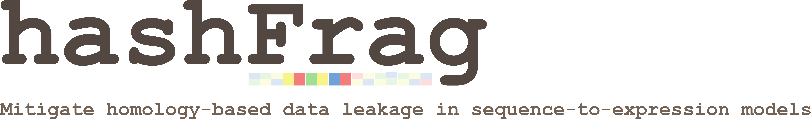

# Overview

Neural networks have emerged as powerful tools to understand the functional relationship between genomic sequences and various biological processes. However, current practices of training and evaluating models on genomic sequences may fail to account for the widespread homology that permeates the genome. Homology spanning test-train data splits can result in [data leakage](https://en.wikipedia.org/wiki/Leakage_(machine_learning)#:~:text=In%20statistics%20and%20machine%20learning,when%20run%20in%20a%20production), potentially leading to overestimation of model performance and a reduction in model reliability and generalizability.


hashFrag represents a scalable tool that leverages [BLAST](https://blast.ncbi.nlm.nih.gov/Blast.cgi) to help users address homology-based data leakage during model development. The general workflow involves utilizing the BLAST algorithm to identify “candidate” pairs of sequences with high similarity, filtering these candidates based on a specified similarity threshold, and then using the resulting homology information to mitigate the potential occurrences of data leakage. 

We utilize local alignment score to quantify the degree of homology between a pair of sequences. By default, the alignment score will be derived from the top BLAST alignment result for a pair of sequences (Basic usage). However, users also have the option to provide precomputed alignment scores for added control over the homology search process (see Advanced usage). 

Because the precise definition of homology depends on the dataset or hypothesis under test, we also aim to provide general guidelines for users to choose an appropriate similarity threshold for their purposes. Notably, defining homology in terms of alignment scores requires the specification of scoring parameters (e.g., mismatch, gap open, and gap extension penalty scores and match reward), and changing these parameters can drastically impact the identification process of homology. Please see permissible scoring parameter combinations for the BLASTn algorithm [here](https://www.ncbi.nlm.nih.gov/sites/books/NBK279684/) (Table D1).

# Installation

placeholder

# Basic usage

## Existing data splits

Existing train-test data splits can be handled by providing two separate FASTA files to hashFrag as input. This limits the homology search process to inter-data split comparisons. Specifically, a BLAST database is constructed over the train sequences and the test sequences are queried against this database to identify pairs with high local alignment scores. 

> Filter sequences in the test split exhibiting homology with any sequences in the train split. This requires specification of an alignment score threshold to define homology between sequences.
```
hashFrag filter_test_split \
--train_fasta_path K562.sample_8000.train.fa.gz \
--test_fasta_path K562.sample_2000.test.fa.gz \
--threshold 60
```

> Stratify the test split sequences into an arbitrary number of levels based on their maximum alignment scores to the train split sequences. 
```
hashFrag stratify_test_split 
--train_fasta_path K562.sample_8000.train.fa.gz \
--test_fasta_path K562.sample_2000.test.fa.gz
```
Note that the sizes of each stratified level will not necessarily be balanced. This can be useful to better understand a model’s behaviour over test splits at varying levels of orthogonality to the sequences the model was trained on.

## Creating data splits

When a single FASTA file is provided as input, hashFrag will characterize homology for all pairwise comparisons. This involves constructing a BLAST database over all sequences in the population and then subsequently querying each sequence to the databae. 

> Create homology-aware (i.g., orthogonal) train-test data splits. This requires specification of an alignment score threshold to define homology between sequences.
```
# hashFrag create_orthogonal_splits \
--fasta_path K562.sample_10000.fa.gz \
--threshold 60
```
The creation of orthogonal train-test splits entails a graph-based method to identify all groups of sequences exhibiting distinct cases of homology. Splits are created proportionally. 

# Advanced usage

The basic usage commands are implemented as pipelines that execute a series of modules. To provide users with additional control and flexibility over this homology search process, users can directly call these modules.

One particular reason why users might want to call modules individually is that it enables the use of precomputed pairwise scores. Specifically, after identifying candidate pairs of sequences with the BLAST algorithm, instead of using BLAST-derived alignment scores, users can provide the optimal [Smith-Waterman](https://en.wikipedia.org/wiki/Smith%E2%80%93Waterman_algorithm) local alignment scores for candidate pairs. We found this can improve recall at a given alignment score threshold. When providing precomputed pairwise scores to hashFrag, the expected format is a tab-delimited file with 3 columns: `id_i`, `id_j`, and `score`. 

`example.tsv`
```
seq_A	seq_B	60
seq_C	seq_D	85
seq_E	seq_A	100
...     ...     ...
```

For a full breakdown of available modules, please see the notebooks provided in the `/tutorials` directory in this repository.

# Paper

placeholder